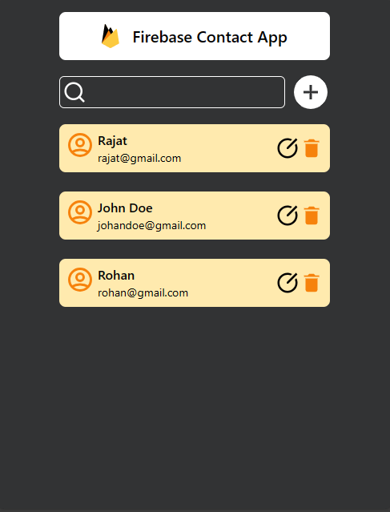

# React Contact App

This is a simple React contact management application that allows users to add, update, delete and search for contacts. The app integrates with Firebase for storing contact data.

## Features

- **Create:** Add new contacts with name and email information.
- **Read:** View a list of contacts and search for contacts by name.
- **Update:** Modify existing contact details.
- **Delete:** Remove contacts from the list.
- **Firebase Integration:** Real-time data updates using Firebase Firestore.

### Prerequisites

Before you begin, ensure you have the following installed on your machine:

- Node.js
- npm
- Firebase account (for database storage)

### Installation

Follow these steps to set up and run the project locally:

1. Clone the project repository to your local machine.

2. Install the necessary dependencies using npm:

   ```
   npm install
   ```


3. Start the development server:
    ```
    npm run dev
    ```
## Tech Stack
- React
- Firebase (Firestore)
- Formik (for form handling)
- Tailwind CSS (for styling)
- React Icons
- React Toastify

## Screenshot


